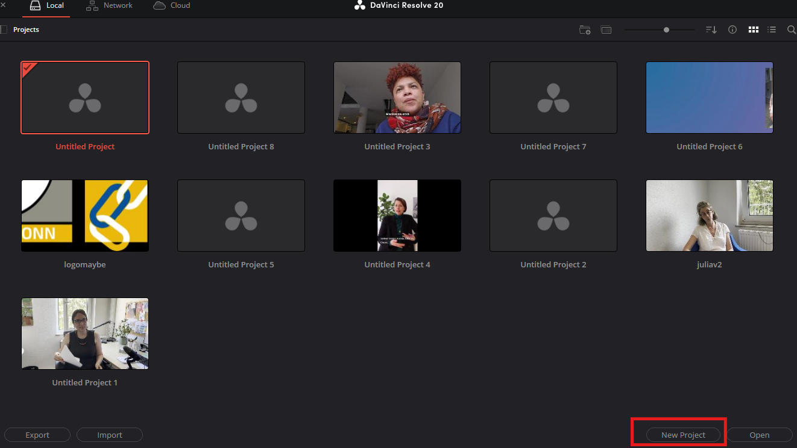
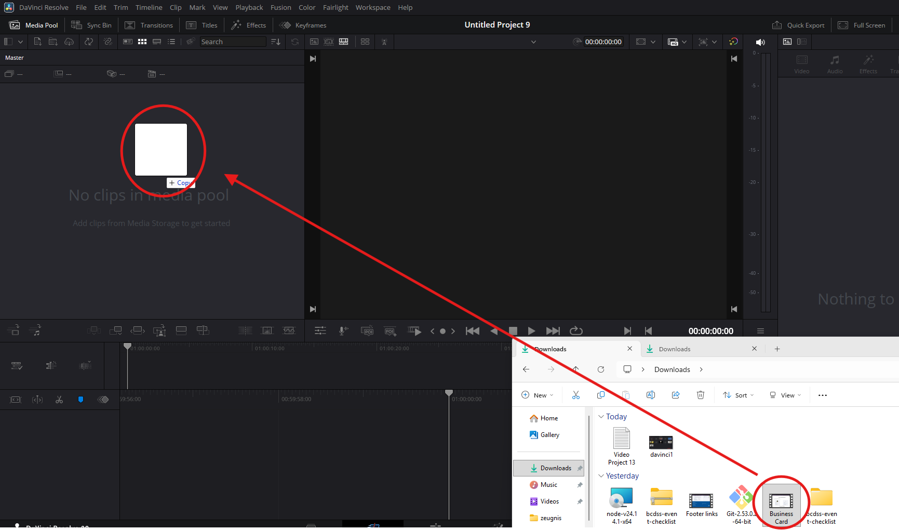
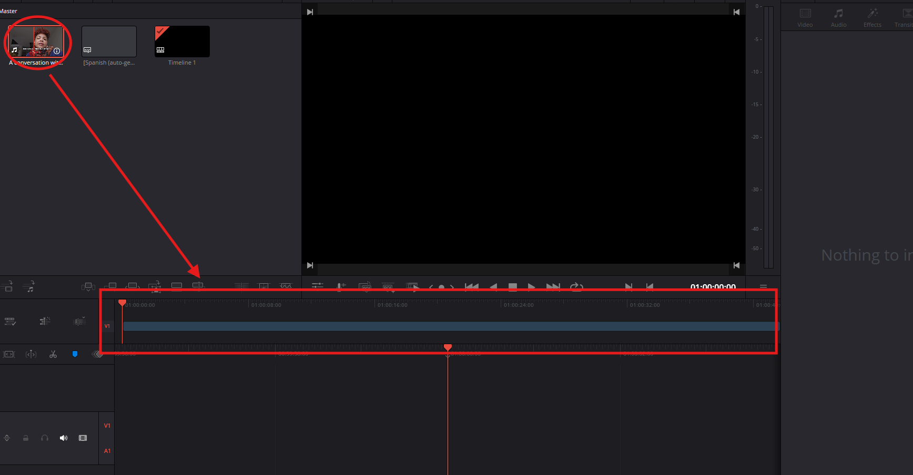
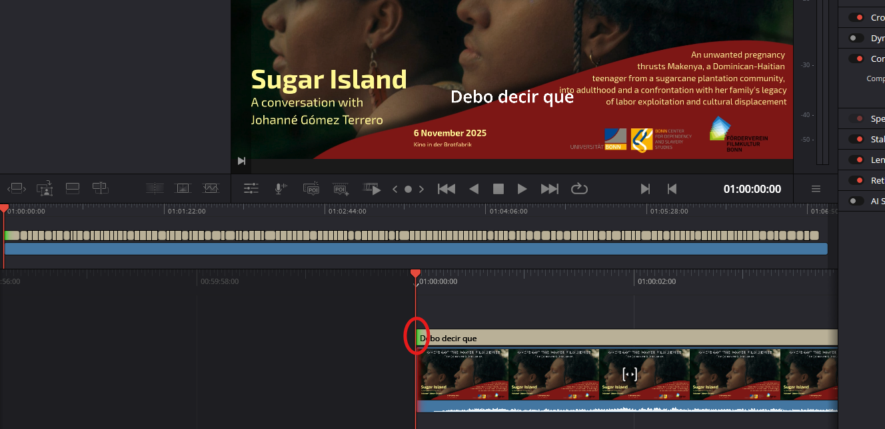
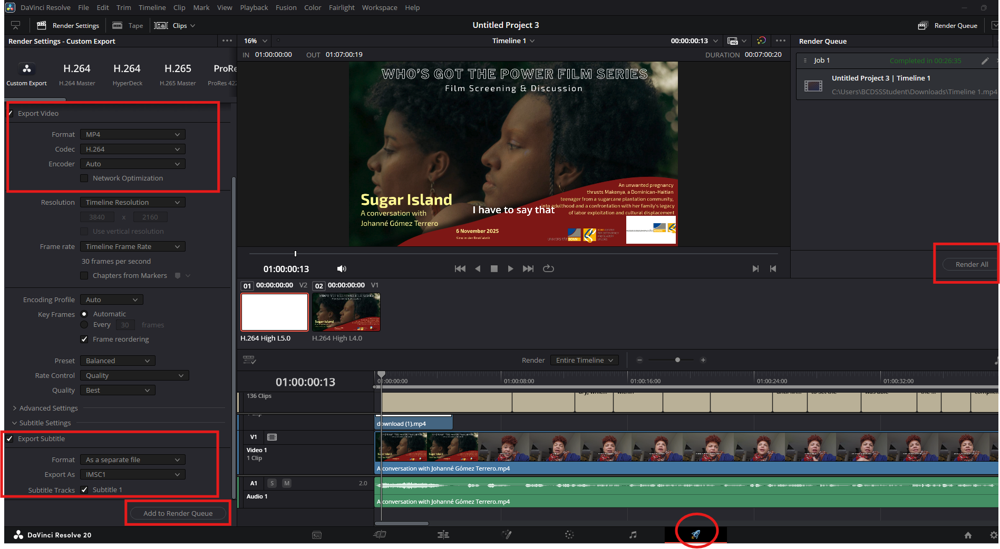

# Adding Subtitles to Videos

## Best Tool: Clipchamp

**Clipchamp** is free and comes preloaded on Windows computers. It can automatically create subtitles for you.

---

## Steps

### Step 1: Open Clipchamp

1. Open **Clipchamp** on your computer
2. Click **"Create a new video"**

### Step 2: Add Your Video

1. On the left side, you'll see a **Media** column
2. Drag your video file into this column
3. From the column, either drag the video to the timeline or click on the "+" that appears on its bottom-right.

### Step 3: Add Captions

1. Look at the **top right** of the screen
2. Click **"Captions"**
3. Click **"Try now"**

### Step 4: Transcribe (Automatic Subtitles)

1. Select your **language**
2. Click **"Transcribe media"**
3. Go for a quick pee or grab a coffee. This may take a few minutes

Clipchamp will automatically listen to your video and create subtitles.

### Step 5: Review and Download

1. Once finished, the subtitles will appear in your video
2. If you want to **edit the text**, you can do it directly from the app or download the file as an **.srt file**

---

## Translating Subtitles to Another Language

Clipchamp doesn't let you add custom subtitles directly. To translate subtitles, use **DaVinci Resolve** instead.

### Step 1: Create a New Project

1. Open **DaVinci Resolve**
2. Click **"New Project"**

### Step 2: Add Your Files

1. Drag your **video file** into the **Media Pool** (left side)
2. Drag your **translated .srt file** into the **Media Pool**
3. If asked about frame rate, just click **"Yes"** and continue

### Step 3: Add to Timeline

1. Drag the **video** to the timeline (bottom editing area)
2. Drag the **subtitle file** to the timeline below the video

### Step 4: Sync Subtitles

The subtitles should match the video automatically. If they don't:
- Drag the subtitle element left or right on the timeline until it lines up with the video

### Step 5: Export with Subtitles

1. On the bottom menu, click the **rocket icon** labeled **"Deliver"**
2. Select **MP4** format
3. Select **H.264** codec
4. Scroll down to **"Audio"** settings and set the codec to **Mono** — this ensures headphone users hear audio on both sides
5. Scroll down and find **"Subtitle Settings"**
6. Make sure it's clicked and the correct subtitle track is selected
7. Click **"Add to Render Queue"**
8. On the right side, click **"Render All"**

Your video with subtitles will now be created.
---
