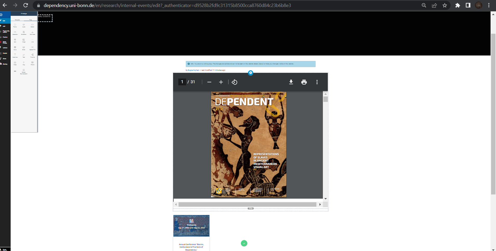

## iFrame (Plone)

### What it does
An **iFrame** displays content, mainly PDF, from a given URL directly inside a webpage. This would allow the user to browse a PDF file without opening another link or downloading.
We have never used this and I don't see why we ever would. But it is there, and we know about it!

### Important restriction
- The item **must be uploaded on plone**
- External sources are blocked for security reasons

### How to use
1. Upload your file to Plone
2. Copy the file’s URL (must include `uni-bonn`)
3. Open the page where you want to embed it
4. Go to **Tiles menu**
5. Add an **iFrame**
6. Paste the URL into the iFrame field

